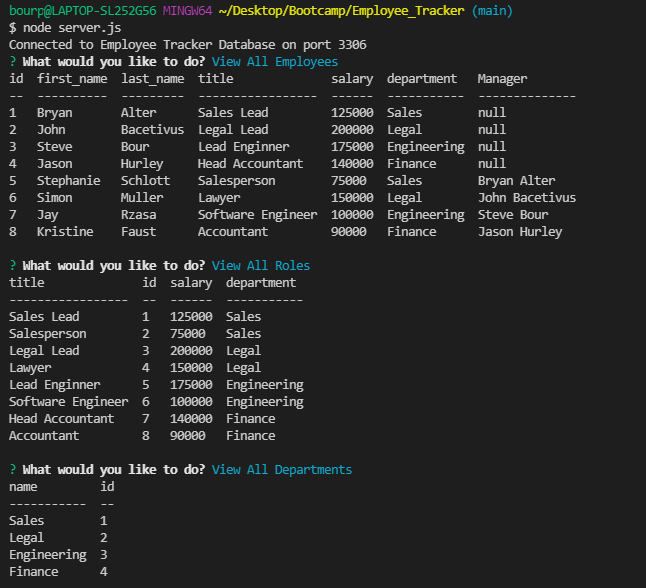
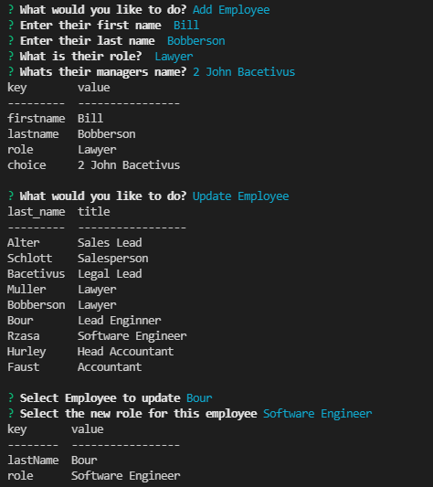

# Employee Tracker
  

  ## Description
  
  A command line prompt program that can track all of your employees, their managers, roles, departments, and salaries. Functionality exists to update employee roles, as well add new employees, roles, and departments, as needed.
  
  ## Table of Contents (Optional)
  
  * [Installation](#installation)
  * [Usage](#usage)
  * [Contribute](#contributing)
  * [Testing](#testing)
  * [Questions](#questions)
  
  ## Installation
  
  To install necessary dependencies, run the following command: 

  npm i

  ## Usage

  Walkthrough Video: https://drive.google.com/file/d/1GbrND-Fo9IyQxq0IGRn8-VIYruBo1LFa/view 
  
  ## How to Contribute
  
  nothing

  ## Testing
  
  To run tests, run the following command:

  
  
  ## Questions
  
  If you have any questions about the repo, open an issue or contact me directly at bourpower@gmail.com. You can find more of my work at [sbour1](https://github.com/sbour1/).
  

